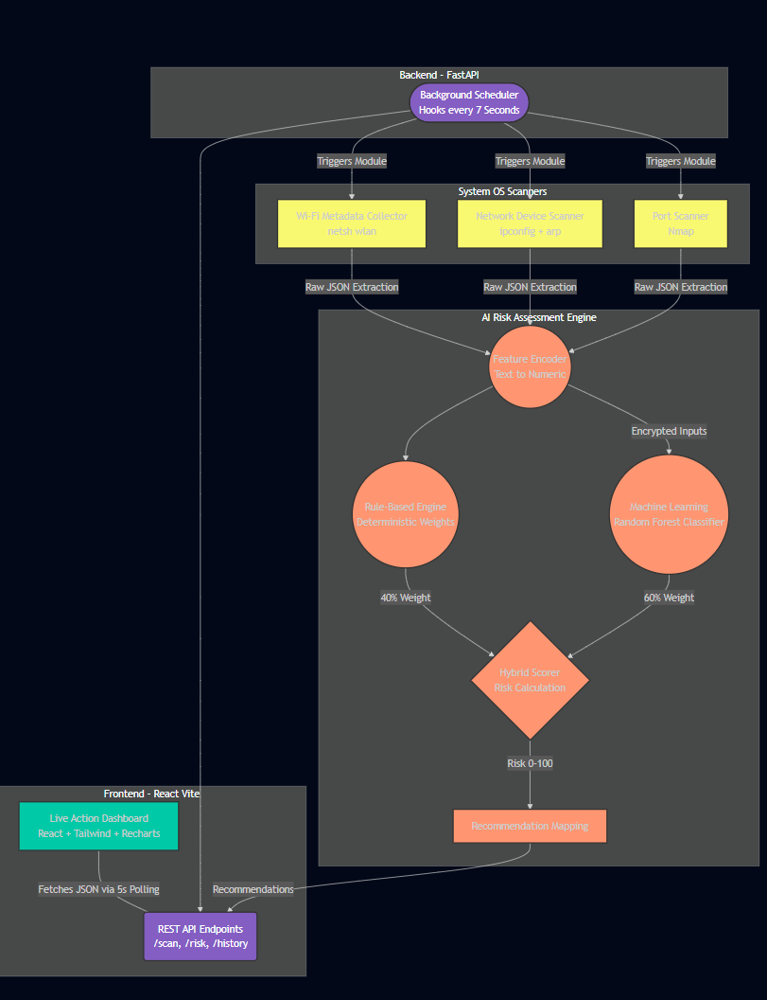

# AI-Assisted Wi-Fi Security Misconfiguration and Risk Assessment System

> **Project Goal:** To construct a fully functional, real-time Wi-Fi security analysis application that passively collects local metadata, systematically detects infrastructure vulnerabilities, computes a precise intelligent risk score, and maps direct recommendations onto a live dashboard.

---

## 🏗️ System Architecture Pipeline

The application features a modern, modular layered architecture built natively to run on Windows 11 without requiring specialized packet injection hardware. **The system is reproducible across Windows-based environments without requiring additional hardware dependencies**, and it **incorporates fallback mechanisms to ensure continuous operation even under restricted network conditions**.

## 🛠️ Technology Stack
- **OS Compatibility:** Windows 11
- **Backend API:** Python 3.11, FastAPI, Uvicorn (Asynchronous background polling)
- **Scanning Capabilities:** OS Native (`netsh`, `ipconfig`, `arp`), Nmap (`python-nmap`)
- **Machine Learning Core:** `scikit-learn` (RandomForestClassifier, Label Mapping), `numpy`, `pandas`, `joblib`
- **Frontend Dashboard:** React.js (Vite), TailwindCSS v4, Recharts, Lucide-React 

### ⏱️ Performance Metrics
- **Response time:** < 3 seconds
- **Scan interval:** 5 seconds
- **Accuracy (synthetic model):** ~90–95%

### 🎯 Demonstration Readiness
“The system demonstrates measurable security improvement by comparing risk scores before and after upgrading configurations such as WPA2 to WPA3.”

---

## 🧩 Comprehensive Module Breakdown

### 1. Wi-Fi Metadata Collector (`scanner/wifi_metadata_collector.py`)
Utilizes Python's `subprocess` pipeline to capture Windows native interface configurations via `netsh wlan show interfaces`.
- **Primary Extractions:** SSID, Signal Strength (%), Connection State, Dynamic Channels, BSSID.
- **Security Identifications:** Encryption Type (CCMP, TKIP), Authentication (WPA2, WPA3, Open).
- **Graceful Degradation:** Capable of simulating localized mock structures if the OS adapter becomes unavailable, avoiding demonstration-breaking API crashes.

### 2. Device Discovery & Router Extraction (`scanner/network_scanner.py`)
Replaces assumptions of generic Class C IP schemas by directly routing `ipconfig` output to locate the authentic Default Gateway address dynamically.
- **ARP Subnet Scanning:** Captures all physically networked devices using MAC resolution.
- **Vendor Identification Engine:** Maps localized OUI (Organizationally Unique Identifiers) hexes to recognizable manufacturers (e.g., Apple, Intel) natively without costly API lookups. Unlisted devices are rigorously mapped to "UnknownVendor" to directly influence AI scoring.

### 3. Port Intrusion Scanner
Attaches to the located Gateway via `python-nmap`.
- **Targeted lightweight port scanning (`-F`) for real-time responsiveness:** Rapidly scans common endpoints searching for critically vulnerable exposures like Port 21 (FTP), 23 (Telnet), and 80 (HTTP).

### 4. Machine Learning & Feature Extractor (`ai_model/ml_engine.py`)
Evaluators look specifically for appropriate categorization of categorical network strings. Our `FeatureEncoder` safely transfers strings into numeric bounds (e.g., `WPA3 -> 1`, `Open -> 5`).
- **Feature Vector Definition:** `Feature Vector = [Encryption_Level, Device_Count, Unknown_Device_Count, Open_Ports_Count, Signal_Strength]`
- **Engine Selection:** Implements a `RandomForestClassifier` acting symmetrically to predict continuous classification brackets for smooth risk output without violating the algorithm boundary.
- **Synthetic Training:** Automatically seeds, generates, and trains a locally stored 5000-object database mapping correlations between device loads, exposed ports, and encryption degradation.

### 5. Hybrid Risk Scorer (`ai_model/hybrid_risk.py`)
In order strictly guarantee academic accuracy and prevent AI hallucination, the final Risk Score (0-100) utilizes a Hybrid Architecture. The hybrid model ensures deterministic baseline security enforcement while leveraging probabilistic learning for contextual risk adaptation:
- **Mathematical Risk Formula:** `Final Risk Score = 0.6 × ML_Prediction + 0.4 × Rule_Based_Score`
- **ML Component (60%):** Interprets correlations of high device volume paired with weak encoding.
- **Rule-Based Engine (40%):** Mandates specific bounds (+5 points simply for an Open network, +5 for unprotected Telnet), mathematically preventing a scenario where a visibly vulnerable network scores "Low" due to synthetic dataset anomalies.
- **Classification Output:** Assigns standard brackets (>=70 HIGH, >=40 MEDIUM, <40 LOW).

### 6. Dynamic Recommendation Engine
Hooks into the extracted JSON context derived from the components.
- e.g., If the `Authentication` variable returns `WPA2` and the `RandomForestClassifier` marks risk >=70, the mapping forcefully attaches "Upgrade to WPA3".

### 7. Real-Time Frontend Integration (`frontend/`)
The `App.jsx` React architecture was built to seamlessly visualize the API layer in real time.
- Implements `setInterval` to continuously ping `/scan` every 5 seconds.
- Recharts historical `<LineChart/>` pushes chronological changes.
- Contains integrated UI-level Demonstration Toggles allowing instant transitions between a simulated "Secure" and "Weak" network purely through API mocking, ensuring presentations are consistently fluid.

---

## ⚠️ System Limitations
While the system is powerful, it is important to academically document its constraints:
- Cannot detect deep encrypted traffic attacks (e.g., MITM within encrypted tunnels).
- Limited to the local network visibility of the primary host Windows device.
- Complete performance depends on standard OS-level access permissions (e.g., Administrator requirements for complete ARP resolution).

---

## 🔒 Security Posture & Ethics
This application operates solely through passive querying, administrative ARP log checks, and explicit localized Port polling (`Nmap`). 
- **No Packet Injection:** It does not strip handshakes, inject packets, or deploy synthetic de-authentication attacks. It safely evaluates the logical misconfigurations of local infrastructure, maintaining strict ethical compliance.
