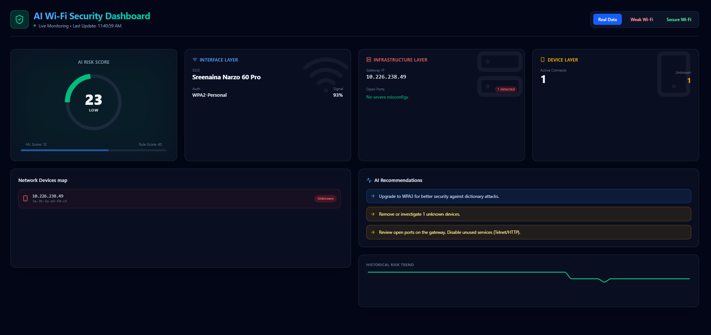

# 🛡️ AI Wi-Fi Security & Risk Assessment

A professional-grade, AI-assisted cybersecurity prototype designed to passively analyze Wi-Fi metadata, detect network misconfigurations, and evaluate real-time security risks using Machine Learning.




## 🎯 Project Overview

This project provides an advanced network security monitoring framework. It utilizes **Isolation Forest** and **Random Forest** machine learning algorithms to learn a specific network's baseline and detect anomalies in real-time. It operates entirely on passive metadata capture—meaning no active packet contents are intercepted or disrupted—making it a safe and educational demonstration of defensive AI.

## ✨ Core Capabilities

- **Passive Metadata Sensing:** Uses native Windows tools (`netsh`, `Get-NetAdapter`) and `psutil` to analyze WPA2/WPA3 distribution and network load without intercepting private packet data.
- **Hybrid Risk Engine (AI + Heuristics):** Combines rule-based vulnerability checks (e.g., Open Ports, WEp/Open encryption) with an Anomaly Detection model trained on your network's unique baseline.
- **Subnet Probing & Identification:** Employs Nmap and ARP-A queries to map connected devices, classify hardware vendors, and expose vulnerable open ports.
- **Dual Interface Design:** 
  - A real-time **FastAPI & React Web App** for live telemetry and monitoring.
  - A classical **Streamlit Data Interface** for rapid prototyping, analysis, and module testing.

## 🗂️ Repository Structure

```text
wifi-security-ai/
├── backend/           # FastAPI backend server
├── frontend/          # React + Vite frontend UI
├── dashboard/         # Streamlit visualizer (Alternative UI)
├── ai_model/          # ML scripts (Model training, Risk Prediction, Encoders)
├── scanner/           # Metadata collectors and traffic/packet sniffers
├── analyzer/          # Rule-based heuristic logic and device classification
├── recommendations/   # Automated security advisory recommendation engine
└── main.py            # Primary pipeline and CLI entry point
```

## 🚀 Quick Start & Setup

### 1. Prerequisites
- **Python 3.8+**
- **Node.js 18+** (Only required if using the React frontend UI)
- **Nmap/Npcap** (Must be installed natively on your Windows environment)

### 2. Installation
```powershell
# Clone the repository
git clone <your-repository-url>
cd <repository-directory>

# Install Python dependencies
pip install -r requirements.txt

# Install Frontend dependencies (Optional, for React UI)
cd frontend
npm install
cd ..
```

### 3. Running the System

You have two ways to interact with the project:

**Option A: Modern Web Stack (FastAPI + React)**
*Recommended for the final demonstration.*

```powershell
# Terminal 1: Start the AI Backend Server
python backend/api.py

# Terminal 2: Start the Web Dashboard
cd frontend
npm run dev
```

**Option B: Terminal CLI + Streamlit Analyzer**
*Recommended for underlying AI analysis and rapid data visualization.*

```powershell
# Calibrate the AI to your network first (-baseline runs for ~60s)
python main.py --baseline

# Start the Streamlit application
streamlit run dashboard/dashboard.py
```

## 🧠 How the AI Works

The intelligence module employs a rigorous Two-Factor risk calculation:
1. **Factor 1 (AI Anomaly):** An Isolation Forest model establishes a "normal" baseline of your traffic throughput and concurrent device counts over time. Any mathematically significant deviation flags an anomaly.
2. **Factor 2 (Security Heuristics):** Static vulnerability parameters, like outdated encryption standards (WEP) or risky open ports (e.g., Port 23 Telnet), statically increase the risk score via a deterministic rule engine.

## 📚 Academic Documentation

For an in-depth review of the system architecture, mathematical workflows, and academic defense topics, refer to:
- [`PROJECT_DOCUMENTATION.md`](PROJECT_DOCUMENTATION.md) - Deep dive into models and modules.
- [`project_overview.md`](project_overview.md) - High-level system workflow and presentation guide.
- [`ACADEMIC_REPORT.md`](ACADEMIC_REPORT.md) - Formal report text suitable for submission.
- [`viva_study_guide.md`](viva_study_guide.md) - Q&A preparation for academic viva.

---
*Note: This is an academic research prototype intended for authorized security auditing, conceptual validation, and demonstration purposes only.*
