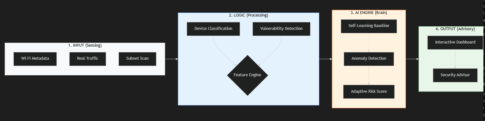

# 🛡️ AI Wi-Fi Security & Risk Assessment: Master Technical Blueprint

This document explains the "inner workings" of the system, covering every technical movement from raw data capture to AI-driven security advisories.

---

## 🗺️  Presentation Architecture (Landscape)

---

## 🚀 1. The 3 Stages of Operation (Project Lifecycle)

To make the AI personal to your network, the project operates in three distinct phases:

### Phase A: Setup & Discovery
The system identifies your active Wi-Fi interface. It uses **`netsh`** to extract your current hardware UUIDs and determines your network's subnet (e.g., `192.168.1.0/24`).

### Phase B: The Baseline (The "Learning" Move)
When you click **"Calibrate"**, the system captures 60 seconds of "Known Good" behavior. 
- It logs your average device count and typical traffic throughput.
- **The Move**: It trains a local **Isolation Forest** model specifically on *your* baseline data. This creates a mathematical "boundary" of what is normal for your house/office.

### Phase C: Active Monitoring (The "Protection" Move)
The system now compares every new scan against your unique baseline. 
- If a new device connects or traffic spikes, the AI calculates the "distance" from your baseline.
- **The Result**: Real-time Anomaly detection that is tailored to you, not a generic dataset.

---

## 🛠️ 2. Under the Hood: Module Logic

### 📡 Data Sensing (`scanner/`)
*   **Packet Sniffing**: Uses `psutil` to sample delta changes in the `net_io_counters`. It converts raw bytes into a **Network Load %** relative to your peak speeds.
*   **Metadata Extraction**: Parses raw command-line output from Windows `netsh` to identify if you are on **WPA2** (Standard) or **WPA3** (Secure).
*   **Subnet Probing**: Runs **ARP-A** and **Nmap** queries. It maps MAC addresses to hardware vendors (e.g., identifying a "TP-Link" router vs "Apple" phone).

### 🧠 The Hybrid Risk Engine (`ai_model/`)
The system uses a unique "Two-Factor" risk calculation:
1.  **Factor 1 (AI Anomaly)**: The **Isolation Forest** scores the *behavior*. (Is this unusual?)
2.  **Factor 2 (Security Heuristics)**: Fixed logical rules for *known vulnerabilities*.
    *   *Example*: If Port 23 (Telnet) is open, add 20 points to Risk.
    *   *Example*: If Encryption is "Open", add 90 points to Risk.

---

## 📊 3. UI Display Mapping: What triggers what?

| UI Element | Backend Source | Meaning |
| :--- | :--- | :--- |
| **Total Risk %** | `risk_predictor.py` | A blend of AI Anomaly + 5 Security Rules. |
| **Anomaly Status** | `anomaly_model.joblib` | Matches current behavior against saved Baseline. |
| **Connected Inventory** | `network_scanner.py` | Live ARP table of sharing your internet. |
| **Traffic Area Chart** | `traffic_monitor.py` | Real-time moving average of your KB/s throughput. |

---

## 📦 4. Tech Stack Summary

*   **Intelligence**: `scikit-learn` (Isolation Forest), `pandas` (Data Analysis).
*   **Interaction**: `streamlit` (Web Frontend).
*   **Hardware**: `psutil` (Network I/O), `joblib` (Model Storage).
*   **Networking**: `python-nmap` (Subnet probing).

---
